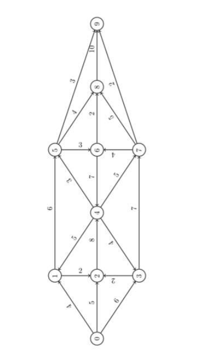

# Flow-EdmondsKarpAlgorithm
Flow of road between towns exercice using ford Fergusson algorithm with Edmonds Karp way to do it.



</br>
This schema refer to this graph:
```
graph = {
    0: {1: 4, 2: 5, 3: 6},
    1: {2: 2, 5: 6},
    2: {4: 8},
    3: {2: 2, 7: 7},
    4: {1: 5, 3: 4, 5: 3, 7: 5},
    5: {6: 3, 8: 4, 9: 3},
    6: {4: 7, 8: 2},
    7: {6: 4, 8: 5, 9: 2},
    8: {9: 10},
    9: {}
}
```
(python dictionnary)
